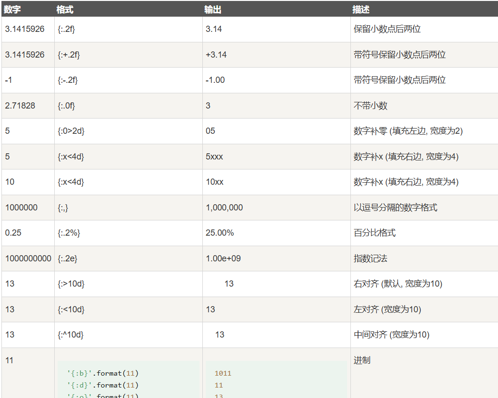

#   excel列格式化
-   可以使用python的format格式化excel的数据
-   配置示例
```json
[
    {
        "Col":0,
        "ColName":"",
        "FormatNum":"{:06d}"
    }
    {
        "Col":0,
        "ColName":"编码",
        "FormatNum":"{:05d}"
    }
]
```
-   Col：列数减1，第一列为0，第二列为1，为空时默认第一列
-   ColName：列名，第一行的内容，为空时使用列数
-   FormatNum：格式化format参数

-   以上配置将格式化input文件中所有xlsx文件的第1列和开头为编码的列
-   不懂format参数可以参考这里
-   
